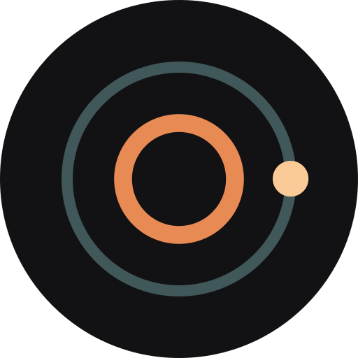
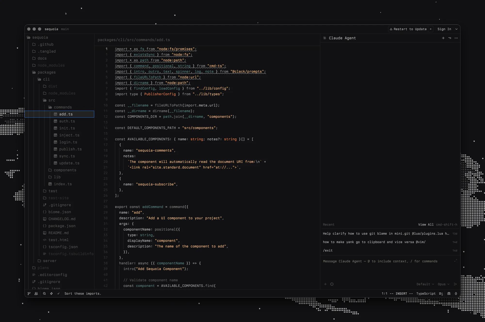

<h3 align="center">
	 
	
	Darkmatter for Zed
	
</h3>

	

A Zed theme based on Base16 Black Metal Bathory, part of [DARKMATTER](https://darkmattertheme.com). The core palette lives in [darkmattertheme/darkmatter](https://github.com/darkmattertheme/darkmatter).

## Installation 

Search for Darkmatter in the Zed extension store and install.
